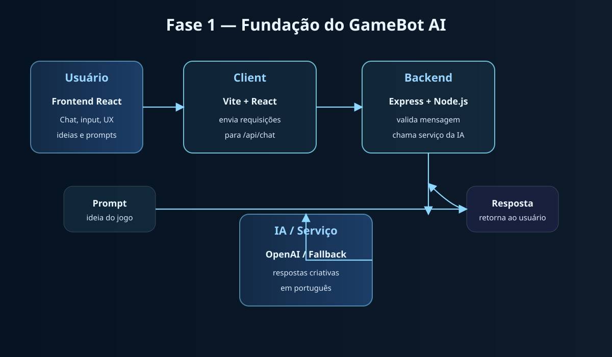
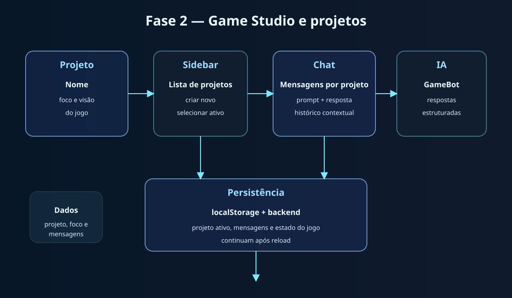
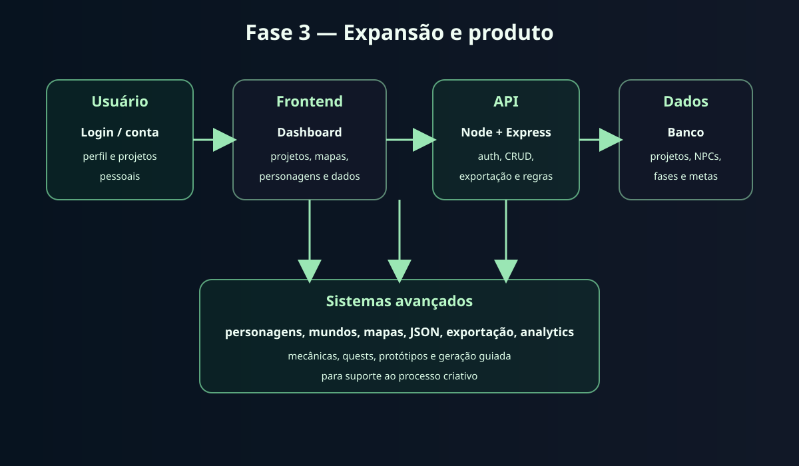
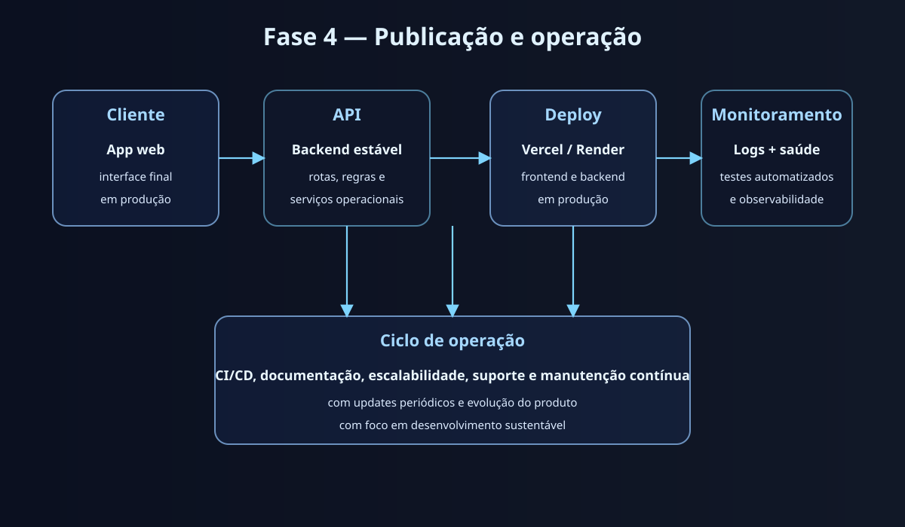
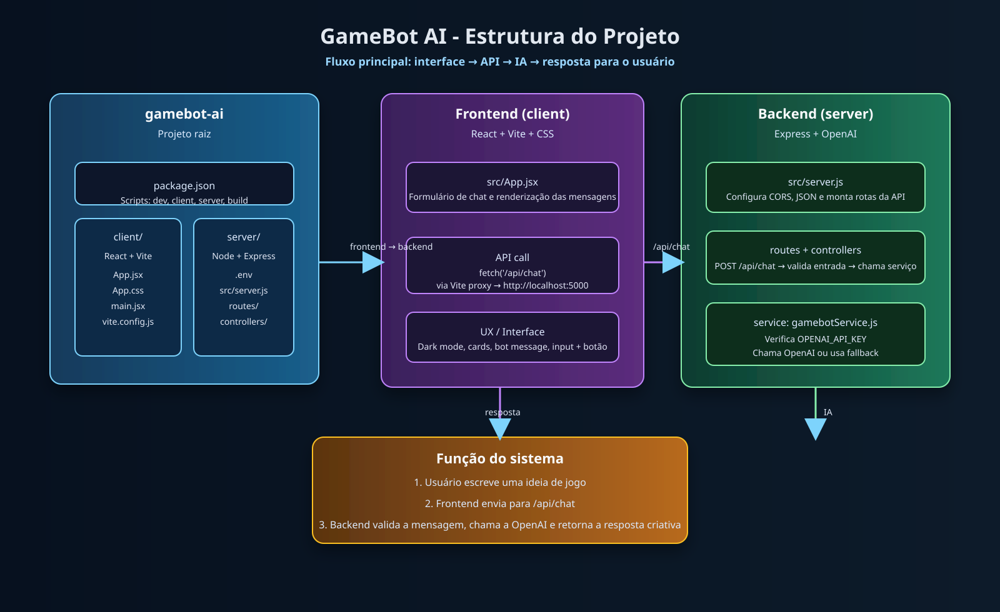
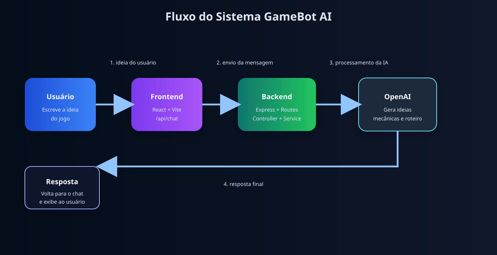

---


<div align="center">

# 🎮 GameBot AI

### 🤖 Assistente inteligente para criação de jogos com IA

<p>
  <strong>Transforme ideias em conceitos, personagens, missões e cenários de jogo.</strong>
</p>

<p>
  O GameBot AI é um projeto de MVP que conecta frontend em React, backend em Node.js + Express e integração com OpenAI para auxiliar no processo criativo de desenvolvimento de jogos.
</p>

<br>


</div>

---

## 🧭 Visão geral do projeto

O GameBot AI foi criado para apoiar o processo de ideação de jogos de forma prática e visual. A aplicação permite:

- criar projetos de jogo
- manter conversas por projeto
- gerar ideias de gameplay, personagens, missões e fases
- salvar e continuar o trabalho após reload
- receber respostas em português
- manter a aplicação funcional mesmo sem chave da OpenAI, usando fallback local

O principal objetivo do projeto é transformar a conversa em um fluxo produtivo de criação de game design, com foco em protótipos rápidos, organização e experimentação.

---

## 🏗️ Arquitetura do processo e evolução por fases

### Fase 1 — Fundação da plataforma

<p align="center">
  
</p>

Nesta fase foi montada a base do sistema:

- frontend em React
- backend em Express
- comunicação com a API de IA
- rota de chat inicial
- estrutura básica do projeto e do fluxo de dados

### Fase 2 — Game Studio e gestão de projetos

<p align="center">
  
</p>

Nesta etapa a plataforma passou a lidar com projetos reais:

- painel lateral com lista de projetos
- criação de novos projetos
- seleção de projeto ativo
- histórico por contexto
- armazenamento local e sincronização com o backend

### Fase 3 — Expansão do produto

<p align="center">
  
</p>

Neste momento o produto foi expandido para um modelo mais robusto, com foco em:

- evolução para um ambiente mais completo de criação
- estrutura para autenticação e dados persistentes
- expansão de personagens, mundos e missões
- preparação para exportação de ideias e evolução de features

### Fase 4 — Publicação e operação

<p align="center">
  
</p>

A fase final organizou o sistema para operação, manutenção e publicação:

- testes do backend
- build do frontend
- organização do projeto para ambiente de produção
- versionamento e estrutura para continuidade do produto

### Arquitetura geral do sistema

<p align="center">
  
</p>

### Fluxo principal de interação

<p align="center">
  
</p>

---

## ✨ Funcionalidades implementadas

### Chat inteligente
- geração de ideias para jogos
- sugestões de personagens e mecânicas
- propostas de fases, missões e desafios
- respostas em português

### Gestão de projetos
- criação de projetos
- seleção do projeto ativo
- histórico de mensagens por projeto
- persistência de estado no navegador e backend

### API e integração
- rota de saúde em /api/health
- rota de chat em /api/chat
- rota de projetos em /api/projects
- resposta local de fallback quando a OpenAI não está disponível

---

## 🧩 Estrutura do projeto

```text
gamebot-ai/
├── README.md
├── LICENSE
├── .gitignore
├── project-architecture.svg
├── project-flow.svg
├── project-phase1-architecture.svg
├── project-phase2-architecture.svg
├── project-phase3-architecture.svg
├── project-phase4-architecture.svg
├── package-lock.json
├── gamebot-ai/
│   ├── package.json
│   ├── client/
│   │   ├── package.json
│   │   ├── vite.config.js
│   │   ├── index.html
│   │   ├── public/
│   │   └── src/
│   │       ├── App.jsx
│   │       ├── App.css
│   │       ├── index.css
│   │       ├── main.jsx
│   │       └── assets/
│   └── server/
│       ├── package.json
│       ├── .env
│       ├── .env.example
│       ├── tests/
│       │   ├── gamebotService.test.js
│       │   └── projects.test.js
│       └── src/
│           ├── server.js
│           ├── controllers/
│           │   ├── chatController.js
│           │   └── gameController.js
│           ├── routes/
│           │   ├── chatRoutes.js
│           │   ├── gameRoutes.js
│           │   └── projectsRoutes.js
│           └── services/
│               ├── gamebotService.js
│               └── ...
```

---

## 🛠️ Stack tecnológica

- React + Vite
- JavaScript
- CSS moderno
- Node.js
- Express
- OpenAI API
- Git + GitHub

---

## 🚀 Como executar

### 1. Clonar o repositório

```bash
git clone https://github.com/RobsonMT2018/gamebot-ai.git
cd gamebot-ai
```

### 2. Instalar dependências

```bash
npm install
npm --prefix gamebot-ai/client install
npm --prefix gamebot-ai/server install
```

### 3. Configurar ambiente

No backend, copie o arquivo de exemplo:

```bash
cp gamebot-ai/server/.env.example gamebot-ai/server/.env
```

Em seguida, configure a variável da OpenAI:

```env
PORT=5000
OPENAI_API_KEY=sua_chave_da_openai
```

> Se a chave não estiver configurada, o backend entra em fallback local para não interromper a experiência.

### 4. Iniciar a aplicação

```bash
cd gamebot-ai/server && npm start
cd gamebot-ai/client && npm run dev
```

### 5. Acessar localmente

- Frontend: http://localhost:5173
- Backend: http://localhost:5000
- Health check: http://localhost:5000/api/health

---

## 🧪 Validação executada

O projeto foi validado com execução real:

```bash
cd /workspaces/gamebot-ai/gamebot-ai/server && npm test
cd /workspaces/gamebot-ai/gamebot-ai/client && npm run build
```

Resultado verificado:

- backend: 4 testes aprovados
- frontend: build do Vite concluído com sucesso

---

## 📌 Status das fases

- [x] Fase 1 — Fundação e arquitetura inicial
- [x] Fase 2 — Game Studio e gestão de projetos
- [x] Fase 3 — Expansão do produto
- [x] Fase 4 — Publicação e operação

### Próximos passos sugeridos
- [ ] personagens e mundos mais detalhados
- [ ] geração de fases e mapas
- [ ] exportação de ideias em arquivos
- [ ] banco de dados e autenticação
- [ ] deploy em ambiente público

---

## 🔐 Segurança

- nunca compartilhe a chave da OpenAI publicamente
- mantenha o arquivo .env apenas no ambiente local
- o arquivo .env foi mantido fora do controle de versão

---

## 👨‍💻 Desenvolvedor

Robson Maciel

---

## 📄 Licença

Este projeto está sob a licença MIT.

---

<div align="center">

### 🎮 GameBot AI

<strong>Transformando ideias em mundos digitais.</strong>

</div>

- nunca compartilhe a chave da OpenAI publicamente
- mantenha o arquivo .env localmente
- o .env já está ignorado no controle de versão

---

## 👨‍💻 Desenvolvedor

Robson Maciel

---

## 📄 Licença

Este projeto está sob a licença MIT.

---

<div align="center">

### 🎮 GameBot AI

<strong>Transformando ideias em mundos digitais.</strong>

</div>

```

> O projeto já está pronto para usar a chave real da OpenAI. Quando a variável estiver configurada, o backend chama a API do OpenAI. Se a chave não existir, o sistema usa um fallback local para não quebrar a aplicação.

### 5. Rode o projeto completo

Na raiz do projeto:

```bash
npm run dev
```

Isso inicia o frontend e o backend em paralelo.

### 6. Acesse a aplicação

- Frontend: http://localhost:5173
- Backend: http://localhost:5000
- Health check: http://localhost:5000/api/health

### 7. Teste o chat

Abra a interface do frontend e envie uma mensagem como:

```text
Crie um jogo de plataforma em pixel art com tema cyberpunk
```

Se a chave estiver correta, a IA responderá com geração real. Caso contrário, o sistema entra em modo fallback para continuar funcionando.

### 8. Rodar apenas backend ou frontend

```bash
npm run server
```

```bash
npm run client
```

---

## 🔐 Segurança da chave da OpenAI

- Nunca compartilhe a chave pública em repositórios
- Mantenha o arquivo `.env` local e protegido
- O arquivo `.env` já está ignorado pelo Git via `.gitignore`
- O arquivo `.env.example` serve como modelo para gerar sua própria chave

---

## 🧪 Validação atual

O projeto já conta com:
- frontend funcionando em React + Vite
- backend em Express
- rota de chat em /api/chat
- integração com OpenAI
- fallback para respostas locais quando a chave não está disponível
- testes básicos do serviço de IA

---

## 🗺️ Roadmap

### Fase 1 — MVP
- [x] Estrutura inicial do projeto
- [x] Frontend do chat
- [x] Backend da API
- [x] Integração com IA
- [x] Documentação inicial do README

### Fase 2 — Melhorias de produto
- [ ] Histórico de conversa
- [ ] Melhorias de UX no chat
- [ ] Salvamento de projetos
- [ ] Geração de personagens e missões

### Fase 3 — Expansão
- [ ] Modo de criação de fases
- [ ] Geração de mapas e sprites
- [ ] Sistema de login
- [ ] Banco de dados

---

## 🔐 Segurança

Nunca compartilhe sua chave da OpenAI publicamente. O arquivo `.env` deve ficar local e protegido.

```gitignore
node_modules/
.env
dist/
```

---

## 👨‍💻 Desenvolvedor

<div align="center">

### Robson Maciel

**Front-End | Desenvolvedor Web | React.js**

Desenvolvedor apaixonado por tecnologia, interfaces modernas e experiência de usuário.

<br>

<a href="https://github.com/RobsonMT2018/gamebot-ai">
  
</a>

</div>

---

## 📄 Licença

Este projeto está sob a licença MIT.

---

<div align="center">

### 🎮 GameBot AI

**Transformando ideias em mundos digitais.**

⭐ Se este projeto for útil, deixe uma estrela no repositório!

</div>

---

## 🚀 Como Executar

### 1. Clonar o repositório

```bash
git clone https://github.com/SEU-USUARIO/gamebot-ai.git
```

### 2. Entrar no projeto

```bash
cd gamebot-ai
```

### 3. Instalar dependências do frontend

```bash
cd client
npm install
```

### 4. Instalar dependências do backend

```bash
cd ../server
npm install
```

### 5. Configurar variáveis de ambiente

Crie um arquivo `.env` dentro da pasta `server`:

```env
OPENAI_API_KEY=sua_chave_da_api
PORT=3001
```

### 6. Iniciar o backend

```bash
cd server
npm run dev
```

### 7. Iniciar o frontend

Em outro terminal:

```bash
cd client
npm run dev
```

Acesse o endereço informado pelo Vite.

---

## 🗺️ Roadmap

### 🟢 Fase 1 — Fundação

- [x] Criar repositório no GitHub.
- [x] Criar README.md.
- [x] Configurar frontend React.
- [x] Configurar backend Node.js.
- [x] Criar interface inicial.
<<<<<<< HEAD
- [x] Integrar API de IA.
=======
- [-] Integrar API de IA.
>>>>>>> 78557ab (feat: melhora visual do chat e documentação do projeto)

### 🔵 Fase 2 — Game Studio

- [ ] Gerador de ideias de jogos.
- [ ] Gerador de personagens.
- [ ] Gerador de missões.
- [ ] Gerador de inimigos.
- [ ] Sistema de projetos.

### 🟣 Fase 3 — Recursos Avançados

- [ ] Histórico de conversas.
- [ ] Login de usuários.
- [ ] Banco de dados.
- [ ] Gerador de código.
- [ ] Editor de protótipos.
- [ ] Integração com Phaser.
- [ ] Integração com Three.js.

### 🚀 Fase 4 — Publicação

- [ ] Testes automatizados.
- [ ] Deploy do frontend.
- [ ] Deploy do backend.
- [ ] Documentação completa.
- [ ] Publicação da primeira versão.

---

## 🖼️ Preview

> Interface gamer futurista com assistente de IA,
> painel de projetos e ferramentas para desenvolvimento
> de jogos digitais.

Em breve, imagens e demonstrações do projeto serão
adicionadas aqui.

---

## 🔐 Segurança

Nunca publique sua chave de API.

Adicione o arquivo `.env` ao `.gitignore`:

```gitignore
node_modules/
.env
dist/
```

---

## 👨‍💻 Desenvolvedor

<div align="center">

### Robson Maciel

**Front-End | Desenvolvedor Web | React.js**

Desenvolvedor apaixonado por programação,
tecnologia e criação de experiências digitais.

<br>

<a href="https://github.com/RobsonMT2018/gamebot-ai">
  
</a>

</div>

---

## 📄 Licença

Este projeto está sob a licença MIT.

---

<div align="center">

### 🎮 GameBot AI

**Transformando ideias em mundos digitais.**

⭐ Se este projeto for útil, deixe uma estrela no repositório!

</div>
