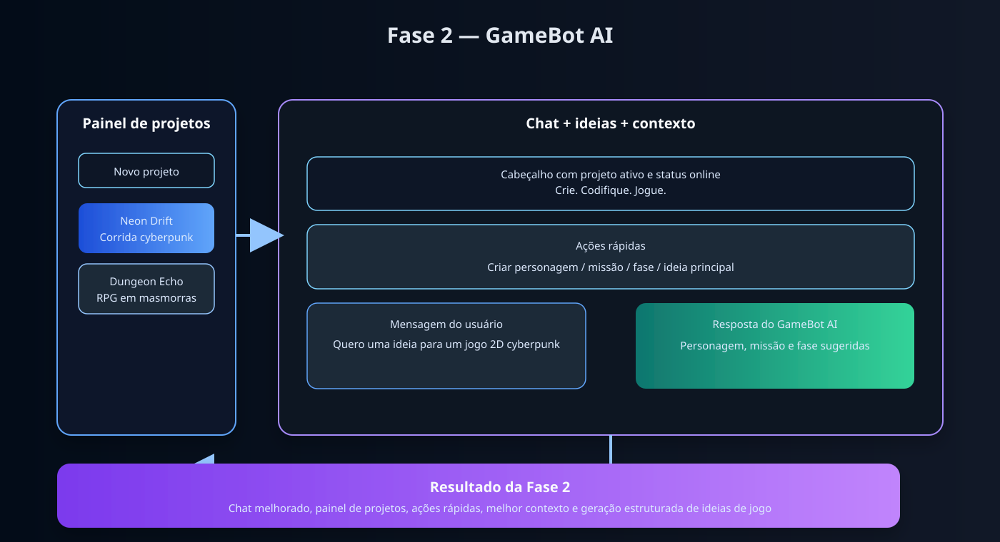

<div align="center">

# 🎮 GameBot AI

### 🤖 Assistente inteligente para ideação e desenvolvimento de jogos

<p>
  <strong>Crie, organize e evolua ideias de jogos com IA.</strong>
</p>

<p>
  O GameBot AI combina React no frontend, Node.js + Express no backend e integração com OpenAI para apoiar a criação de personagens, missões, fases e conceitos de jogos digitais.
</p>

<br>


</div>

---

## 🏗️ Visão geral

O projeto foi pensado como um assistente de criação de jogos com foco em produtividade e experiência de usuário. Ele permite:

- criar projetos de jogo
- manter histórico por projeto
- conversar com a IA sobre ideias, personagens e missões
- receber respostas em português
- continuar trabalhando mesmo quando a chave da OpenAI não estiver configurada, usando fallback local

<p align="center">
  
</p>

<p align="center">
  
</p>

<p align="center">
  
</p>

---

## ✨ Funcionalidades

### Chat inteligente
- sugestões de ideias para jogos
- criação de personagens, missões, fases e desafios
- respostas em português
- visual gamer e ambiente moderno

### Gestão de projetos
- painel lateral com projetos
- criação de projetos em tempo real
- seleção do projeto ativo
- histórico por projeto
- persistência local no frontend

### Backend e API
- servidor em Express
- rota de saúde em /api/health
- rota de chat em /api/chat
- rota de projetos em /api/projects
- fallback funcional quando a IA não está disponível

---

## 🧩 Estrutura do projeto

```text
gamebot-ai/
├── README.md
├── .gitignore
├── LICENSE
├── project-architecture.svg
├── project-flow.svg
├── project-phase2.svg
├── package-lock.json
├── gamebot-ai/
│   ├── package.json
│   ├── client/
│   │   ├── package.json
│   │   ├── vite.config.js
│   │   ├── index.html
│   │   ├── public/
│   │   └── src/
│   │       ├── App.jsx
│   │       ├── App.css
│   │       ├── index.css
│   │       ├── main.jsx
│   │       └── assets/
│   └── server/
│       ├── package.json
│       ├── .env
│       ├── .env.example
│       ├── tests/
│       │   ├── gamebotService.test.js
│       │   └── projects.test.js
│       └── src/
│           ├── server.js
│           ├── controllers/
│           │   ├── chatController.js
│           │   └── gameController.js
│           ├── routes/
│           │   ├── chatRoutes.js
│           │   ├── gameRoutes.js
│           │   └── projectsRoutes.js
│           └── services/
│               ├── aiService.js
│               ├── api.js
│               └── gamebotService.js
```

---

## 🛠️ Tecnologias

- React + Vite
- JavaScript
- CSS moderno
- Node.js
- Express
- OpenAI API
- Git + GitHub

---

## 🚀 Como executar

### 1. Clone o repositório

```bash
git clone https://github.com/RobsonMT2018/gamebot-ai.git
cd gamebot-ai
```

### 2. Instale as dependências

```bash
npm install
npm --prefix gamebot-ai/client install
npm --prefix gamebot-ai/server install
```

### 3. Configure as variáveis de ambiente

No backend, copie o arquivo de exemplo e configure a chave da OpenAI:

```bash
cp gamebot-ai/server/.env.example gamebot-ai/server/.env
```

Arquivo esperado:

```env
PORT=5000
OPENAI_API_KEY=sua_chave_da_openai
```

> Se a chave não estiver configurada, o sistema usa resposta local de fallback para manter a aplicação funcionando.

### 4. Inicie o projeto

Na raiz do projeto:

```bash
npm run dev
```

### 5. Acesse a aplicação

- Frontend: http://localhost:5173
- Backend: http://localhost:5000
- Health check: http://localhost:5000/api/health

---

## 🧪 Validação

Atualmente o projeto possui:

- build do frontend funcionando
- backend em execução
- rota de chat validada
- rota de projetos validada
- testes do backend executando corretamente

Comando de verificação utilizado:

```bash
cd /workspaces/gamebot-ai/gamebot-ai/server && node --test
```

Resultado verificado: 3 testes aprovados, 0 falhas.

---

## 📌 Status do projeto

### Fases concluídas
- [x] Estrutura do monorepo
- [x] Frontend em React + Vite
- [x] Backend em Express
- [x] Chat com IA e fallback
- [x] Gestão de projetos
- [x] Persistência de projetos e mensagens via API
- [x] Atualização do README por fase concluída
- [x] Versionamento no GitHub

### Fase 3 — expansão do produto
- [x] continuação por projeto
- [x] histórico de mensagens preservado
- [x] sincronização de estado com o backend
- [x] fluxo de criação e atualização de projetos

### Próximos passos
- [ ] geração de personagens, mundos e missões mais avançados
- [ ] exportação de ideias em JSON, markdown ou arquivos
- [ ] melhorias de UX e navegação
- [ ] deploy do projeto
- [ ] integração com banco de dados e autenticação

---

## 🔐 Segurança

- nunca compartilhe a chave da OpenAI publicamente
- mantenha o arquivo .env localmente
- o .env já está ignorado no controle de versão

---

## 👨‍💻 Desenvolvedor

Robson Maciel

---

## 📄 Licença

Este projeto está sob a licença MIT.

---

<div align="center">

### 🎮 GameBot AI

<strong>Transformando ideias em mundos digitais.</strong>

</div>

```

> O projeto já está pronto para usar a chave real da OpenAI. Quando a variável estiver configurada, o backend chama a API do OpenAI. Se a chave não existir, o sistema usa um fallback local para não quebrar a aplicação.

### 5. Rode o projeto completo

Na raiz do projeto:

```bash
npm run dev
```

Isso inicia o frontend e o backend em paralelo.

### 6. Acesse a aplicação

- Frontend: http://localhost:5173
- Backend: http://localhost:5000
- Health check: http://localhost:5000/api/health

### 7. Teste o chat

Abra a interface do frontend e envie uma mensagem como:

```text
Crie um jogo de plataforma em pixel art com tema cyberpunk
```

Se a chave estiver correta, a IA responderá com geração real. Caso contrário, o sistema entra em modo fallback para continuar funcionando.

### 8. Rodar apenas backend ou frontend

```bash
npm run server
```

```bash
npm run client
```

---

## 🔐 Segurança da chave da OpenAI

- Nunca compartilhe a chave pública em repositórios
- Mantenha o arquivo `.env` local e protegido
- O arquivo `.env` já está ignorado pelo Git via `.gitignore`
- O arquivo `.env.example` serve como modelo para gerar sua própria chave

---

## 🧪 Validação atual

O projeto já conta com:
- frontend funcionando em React + Vite
- backend em Express
- rota de chat em /api/chat
- integração com OpenAI
- fallback para respostas locais quando a chave não está disponível
- testes básicos do serviço de IA

---

## 🗺️ Roadmap

### Fase 1 — MVP
- [x] Estrutura inicial do projeto
- [x] Frontend do chat
- [x] Backend da API
- [x] Integração com IA
- [x] Documentação inicial do README

### Fase 2 — Melhorias de produto
- [ ] Histórico de conversa
- [ ] Melhorias de UX no chat
- [ ] Salvamento de projetos
- [ ] Geração de personagens e missões

### Fase 3 — Expansão
- [ ] Modo de criação de fases
- [ ] Geração de mapas e sprites
- [ ] Sistema de login
- [ ] Banco de dados

---

## 🔐 Segurança

Nunca compartilhe sua chave da OpenAI publicamente. O arquivo `.env` deve ficar local e protegido.

```gitignore
node_modules/
.env
dist/
```

---

## 👨‍💻 Desenvolvedor

<div align="center">

### Robson Maciel

**Front-End | Desenvolvedor Web | React.js**

Desenvolvedor apaixonado por tecnologia, interfaces modernas e experiência de usuário.

<br>

<a href="https://github.com/RobsonMT2018/gamebot-ai">
  
</a>

</div>

---

## 📄 Licença

Este projeto está sob a licença MIT.

---

<div align="center">

### 🎮 GameBot AI

**Transformando ideias em mundos digitais.**

⭐ Se este projeto for útil, deixe uma estrela no repositório!

</div>

---

## 🚀 Como Executar

### 1. Clonar o repositório

```bash
git clone https://github.com/SEU-USUARIO/gamebot-ai.git
```

### 2. Entrar no projeto

```bash
cd gamebot-ai
```

### 3. Instalar dependências do frontend

```bash
cd client
npm install
```

### 4. Instalar dependências do backend

```bash
cd ../server
npm install
```

### 5. Configurar variáveis de ambiente

Crie um arquivo `.env` dentro da pasta `server`:

```env
OPENAI_API_KEY=sua_chave_da_api
PORT=3001
```

### 6. Iniciar o backend

```bash
cd server
npm run dev
```

### 7. Iniciar o frontend

Em outro terminal:

```bash
cd client
npm run dev
```

Acesse o endereço informado pelo Vite.

---

## 🗺️ Roadmap

### 🟢 Fase 1 — Fundação

- [x] Criar repositório no GitHub.
- [x] Criar README.md.
- [x] Configurar frontend React.
- [x] Configurar backend Node.js.
- [x] Criar interface inicial.
<<<<<<< HEAD
- [x] Integrar API de IA.
=======
- [-] Integrar API de IA.
>>>>>>> 78557ab (feat: melhora visual do chat e documentação do projeto)

### 🔵 Fase 2 — Game Studio

- [ ] Gerador de ideias de jogos.
- [ ] Gerador de personagens.
- [ ] Gerador de missões.
- [ ] Gerador de inimigos.
- [ ] Sistema de projetos.

### 🟣 Fase 3 — Recursos Avançados

- [ ] Histórico de conversas.
- [ ] Login de usuários.
- [ ] Banco de dados.
- [ ] Gerador de código.
- [ ] Editor de protótipos.
- [ ] Integração com Phaser.
- [ ] Integração com Three.js.

### 🚀 Fase 4 — Publicação

- [ ] Testes automatizados.
- [ ] Deploy do frontend.
- [ ] Deploy do backend.
- [ ] Documentação completa.
- [ ] Publicação da primeira versão.

---

## 🖼️ Preview

> Interface gamer futurista com assistente de IA,
> painel de projetos e ferramentas para desenvolvimento
> de jogos digitais.

Em breve, imagens e demonstrações do projeto serão
adicionadas aqui.

---

## 🔐 Segurança

Nunca publique sua chave de API.

Adicione o arquivo `.env` ao `.gitignore`:

```gitignore
node_modules/
.env
dist/
```

---

## 👨‍💻 Desenvolvedor

<div align="center">

### Robson Maciel

**Front-End | Desenvolvedor Web | React.js**

Desenvolvedor apaixonado por programação,
tecnologia e criação de experiências digitais.

<br>

<a href="https://github.com/RobsonMT2018/gamebot-ai">
  
</a>

</div>

---

## 📄 Licença

Este projeto está sob a licença MIT.

---

<div align="center">

### 🎮 GameBot AI

**Transformando ideias em mundos digitais.**

⭐ Se este projeto for útil, deixe uma estrela no repositório!

</div>
